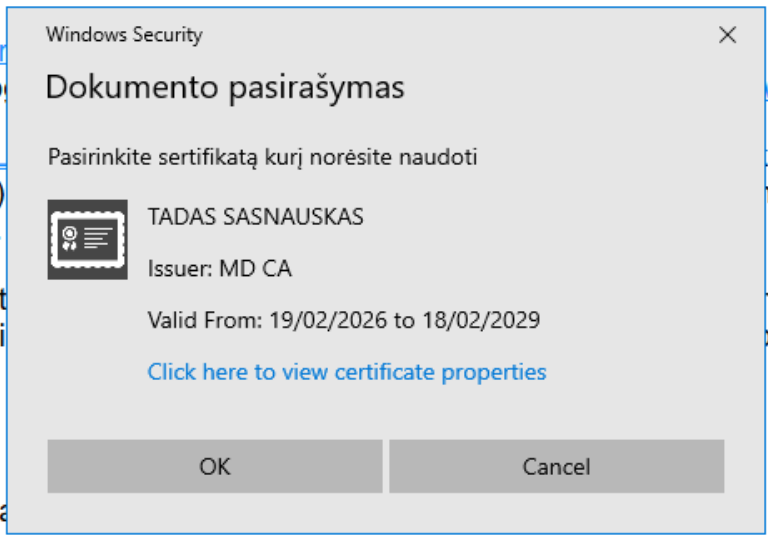
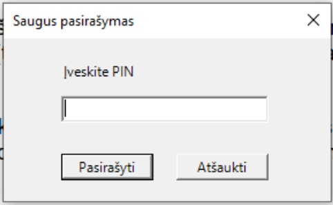

# Elpako programinės įrangos ir epaslaugos.lt prisijungimo su ATK problema

Autorius: Tadas Sasnauskas <tadas@yoyo.lt>

2026-04-17

## Įvadas

Dokumentas apibūdina Elpako programinės įrangos trūkūmą. Pasirašant prisijungimo
duomenis su asmens tapatybės kortele juose nėra įtrauktas konkretus parašo
panaudojimo tikslas. Tuo pačiu tikslas nėra aiškiai komunikuojamas vartotojui.
Ko pasekoje yra galimybė kurti apgaulingas interneto svetaines, prie kurių
besijungiantis vartotojas gali to nežinodamas programišiams suteikti prieigą
prie epaslaugos.lt ir pan svetainių paskyrų.

## Programinės įrangos versija

Apibūdinta problema egzistuoja Elpako 3.2.1 versijoje.

## Techinės detalės

Problemos centre - **Elpako Local API**.

Dokumentacija: [https://documenter.getpostman.com/view/11918038/UVJihuNs#9aa7e102-186c-4ed1-a8e7-7c3ff2be4924](https://documenter.getpostman.com/view/11918038/UVJihuNs#9aa7e102-186c-4ed1-a8e7-7c3ff2be4924)

Pirmiausia reik pastebėti, kad Local API neriboja priegos su
_Cross-Origin Resource Sharing (CORS)_ metodais. Tai reiškia, kad darbui su ATK
paruoštame kompiuteryje šis API prienamas visoms svetainėms.

Šaukinys `https://127.0.0.1:38888/Signing/Sign` leidžia pasirašyti informacinį
žetoną (token) parametre `dbts`.

Pasirašymo metu vartotojui yra parodomas sertifikato pasirinkimo langas:

Po kurio seka PIN langas:

Nei sertifikato, nei PIN langas nenurodo parašo tikslo/paskirties.

Tai leidžia kurti pitavališkas svetaines su ATK prisijungimu, kuriose `Local API`
šaukiniai iš vartotojo naršyklės yra persiunčiami į programišiaus kompiuterį ir
naršyklę. Ko pasekoje, vartotojui jungiantis prie tos piktavališkos svetainės,
programišius gali persiųsti epaslaugos.lt prisijungimo metu išduotą `dbts` žetoną
į vartotojo naršyklę, gauti parašą ir parsisiųsti į savo kompiuterį. Parašas tada
panaudojamas prisijungti prie epaslaugos.lt.

## Demonstracija

Demonstracijos įrašas pateiktas atskirai.
